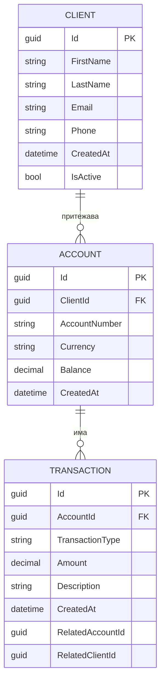

```mermaid
erDiagram
  CLIENT {
    guid Id PK
    string FirstName
    string LastName
    string Email
    string Phone
    datetime CreatedAt
    bool IsActive
  }

  ACCOUNT {
    guid Id PK
    guid ClientId FK
    string AccountNumber
    string Currency
    decimal Balance
    datetime CreatedAt
  }

  TRANSACTION {
    guid Id PK
    guid AccountId FK
    string TransactionType
    decimal Amount
    string Description
    datetime CreatedAt
    guid RelatedAccountId
    guid RelatedClientId
  }

  CLIENT ||--o{ ACCOUNT : "притежава"
  ACCOUNT ||--o{ TRANSACTION : "има"
```

