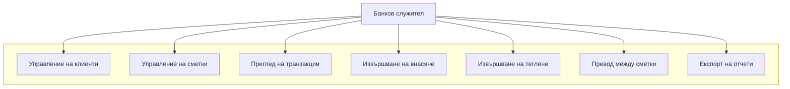

```mermaid
flowchart TB
 subgraph BankAccountManager[" "]
        UC1["Управление на клиенти"]
        UC2["Управление на сметки"]
        UC3["Преглед на транзакции"]
        UC4["Извършване на внасяне"]
        UC5["Извършване на теглене"]
        UC6["Превод между сметки"]
        UC7["Експорт на отчети"]
  end
    Clerk["Банков служител"] --> UC1 & UC2 & UC3 & UC4 & UC5 & UC6 & UC7
```
