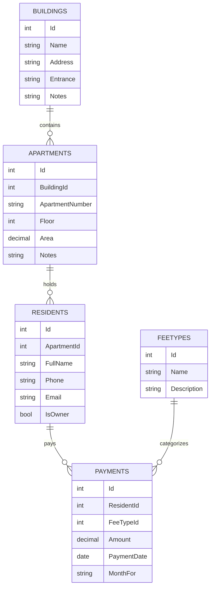

## ER / Database Diagram (Mermaid)

```mermaid
erDiagram
    BUILDINGS ||--o{ APARTMENTS : contains
    APARTMENTS ||--o{ RESIDENTS : holds
    RESIDENTS ||--o{ PAYMENTS : pays
    FEETYPES ||--o{ PAYMENTS : categorizes

    BUILDINGS {
        int Id
        string Name
        string Address
        string Entrance
        string Notes
    }

    APARTMENTS {
        int Id
        int BuildingId
        string ApartmentNumber
        int Floor
        decimal Area
        string Notes
    }

    RESIDENTS {
        int Id
        int ApartmentId
        string FullName
        string Phone
        string Email
        bool IsOwner
    }

    FEETYPES {
        int Id
        string Name
        string Description
    }

    PAYMENTS {
        int Id
        int ResidentId
        int FeeTypeId
        decimal Amount
        date PaymentDate
        string MonthFor
    }
```

