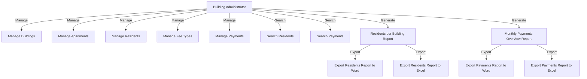

## Use Case Diagram (Mermaid)

```mermaid
graph TD
    Admin[Building Administrator] -->|Manage| UC_Buildings[Manage Buildings]
    Admin -->|Manage| UC_Apartments[Manage Apartments]
    Admin -->|Manage| UC_Residents[Manage Residents]
    Admin -->|Manage| UC_FeeTypes[Manage Fee Types]
    Admin -->|Manage| UC_Payments[Manage Payments]
    Admin -->|Search| UC_SearchResidents[Search Residents]
    Admin -->|Search| UC_SearchPayments[Search Payments]
    Admin -->|Generate| UC_ReportResidents[Residents per Building Report]
    Admin -->|Generate| UC_ReportPayments[Monthly Payments Overview Report]
    UC_ReportResidents -->|Export| UC_ReportResidents_Word[Export Residents Report to Word]
    UC_ReportResidents -->|Export| UC_ReportResidents_Excel[Export Residents Report to Excel]
    UC_ReportPayments -->|Export| UC_ReportPayments_Word[Export Payments Report to Word]
    UC_ReportPayments -->|Export| UC_ReportPayments_Excel[Export Payments Report to Excel]
```

